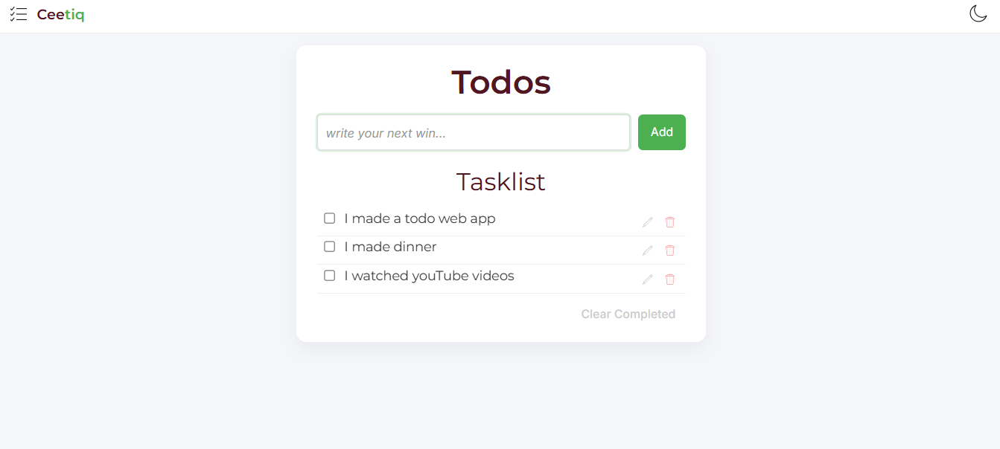
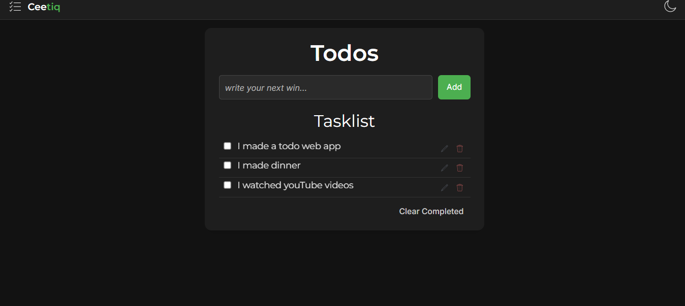
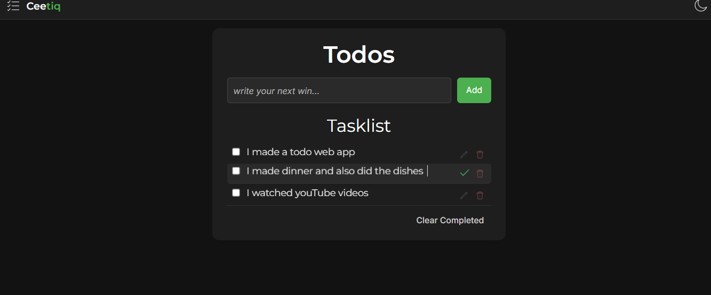
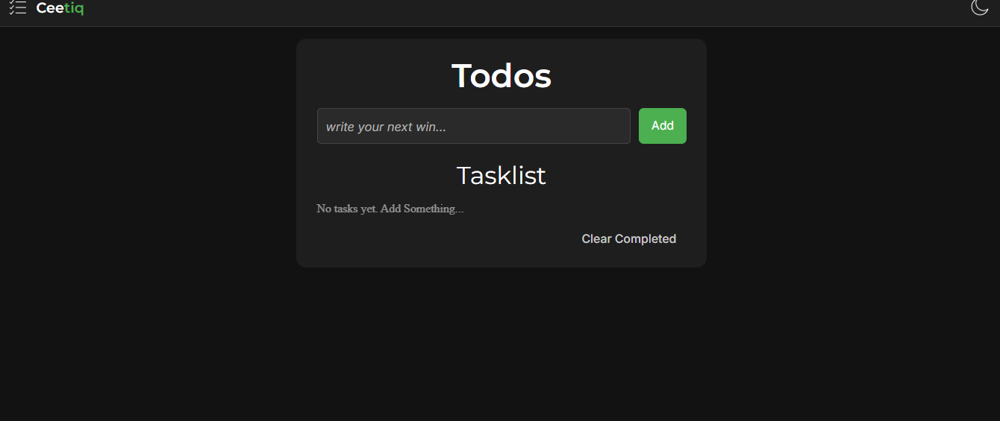

# Ceetiq — Smart Todo Manager

Ceetiq is a clean and modern todo web app designed to help users stay organized and productive.
Built with vanilla JavaScript, it focuses on simplicity, speed and a smooth user experience.

---

## 🚀 Features

* ✅ Add, edit and delete tasks
* ✏️ Inline editing
* 🌙 Dark mode (with saved preference)
* 🧹 Clear completed tasks
* 💾 Data stored in localStorage
* 🎨 Clean and responsive UI

---

## 🛠️ Built With

* HTML
* CSS (Flexbox + Variables)
* JavaScript (Vanilla JS)

---

## 📸 Preview

### Light Mode

### Dark Mode

### Editing

### Empty State

---

## 💡 What I Learned

* DOM manipulation
* Event handling
* State management
* UI/UX improvements
* Local storage usage

---

## 🔗 Live Demo

[Click here to view the app](https://ceecee-ferdy.github.io/todo-app/)

---

## 📂 How to Run

1. Clone the repository
2. Open `index.html` in your browser

---

## 🙌 Acknowledgment

This project was built as part of my journey to becoming a frontend developer.
